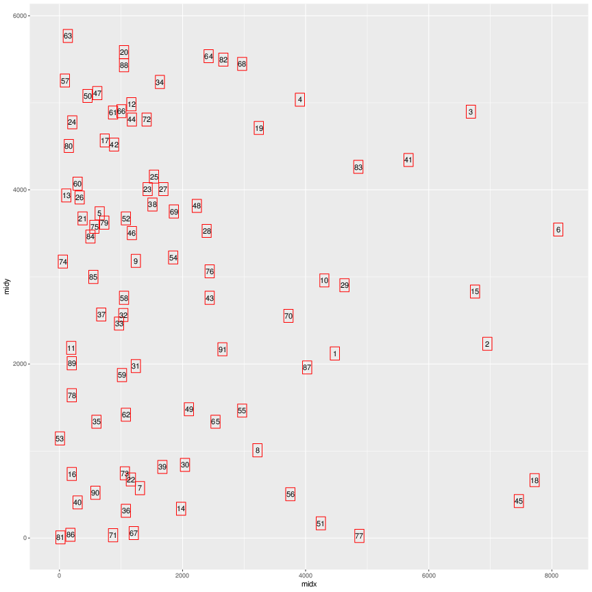
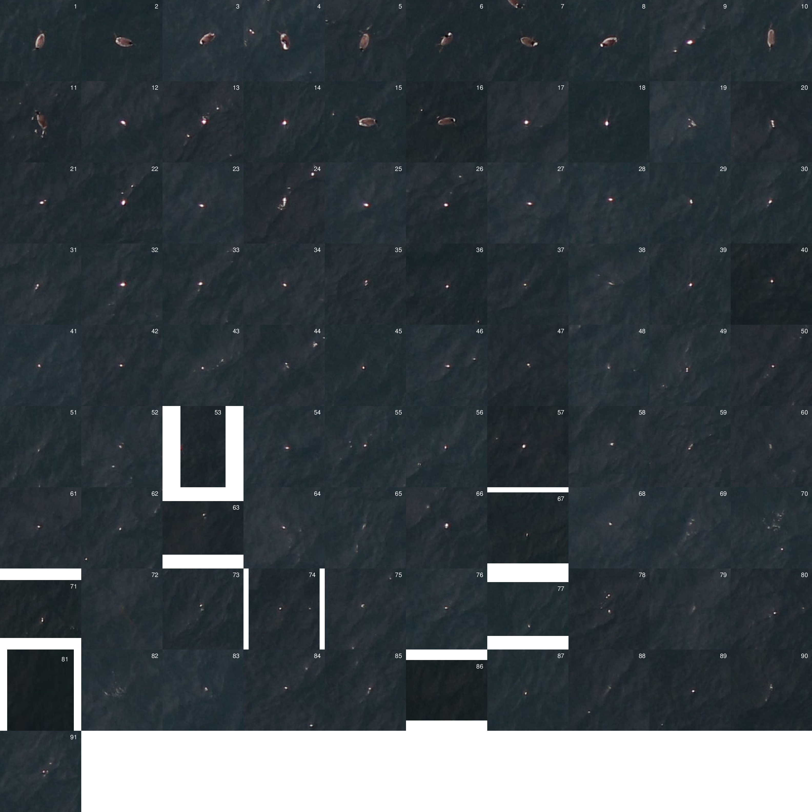
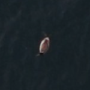
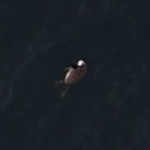
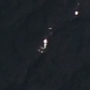

\# dirtybirds — finding interesting targets in photographs of the ocean
surface
================
15 October, 2018

<!-- README.md is generated from README.Rmd. Please edit that file -->

This is an R package for taking high resolution images (in raw, CR2
format) and then identifying squares that are outside of the norm. These
are cropped out and placed in a folder so people can classify them into
categories of training data.

## Installation

Do it from GitHub:

``` r
devtools::install_github("eriqande/dirtybirds")
```

## Processing a single image

This is done within R, simply loading the package and then calling a
single function. Here we show that using the default settings. Note that
it takes about 2 to 4 minutes to process each image. My thought is that
we throw it all onto a cluster and farm short jobs out to thousands of
nodes so that we can do thousands of images per hour

``` r
library(dirtybirds)

find_and_crop_targets(img = "../seabird-machine-learning/data/1G7A3415.CR2",
                      outdir = "/tmp/dirty-birds-readme-example")
```

In the above, the function is being run on one of the images that Josh
provided to me in the early days. The output is going to go into a
directory within `/tmp` called `dirty-birds-readme-example`. This
directory will be created if it does not exist. For each image that is
processed into that outdir, a separate directory will be created. For
example, the above function call will create the directory
`/tmp/dirty-birds-readme-example/1G7A3415`. The important contents of
that directory are as follows:

  - `positions-1G7A3415.pdf`: This shows the positions of each of the
    final tiles that were extracted (as possible targets) from the
    image. This may or may not be something that people want to look at.
    It might be helpful. At any rate, it looks like this:



  - `proof-sheet-1G7A3415.pdf` This is a single file that gives a
    numbered overview of all the extracted tiles. This is a nice thing
    to look at so you know how many tiles have interesting targets on
    them. It looks like this:



After that we have all the individual images named like:
`tile_IMGNAME_IDX-xmin-xmax-ymin-ymax.tif`, where IMGNAME is the name of
the image, IDX is the index of the tile when they are all arranged in
terms of which has the most interesting looking targets (basically it is
the number (with leading zeroes) that is in the upper right corner of
each image on the proofsheet). And then xmin, xmax, ymin, ymax are the
pixel positions of the square defining the image. I had originally
thought I would use these positions to extract the squares from the CR2
files using ImageMagick, after they had all been sorted into different
target categories. However, I just looked into that and ImageMagick
can’t write in CR2 format. I don’t know how to extract just a small
area from a CR2 file and save that as a CR2 file. So, I decided to just
write the images out as TIFFs, and I suspect those should be fine as
input to the machine learning algorithms. We could do JPG too, which
would take less space, but might involve some loss in the compression.

At any rate, here are few examples:

  - `tile_1G7A3415_001-4401-4551-2045-2195.tif`, a grebe



  - `tile_1G7A3415_006-8029-8179-3469-3619.tif`, another grebe



  - `tile_1G7A3415_024-133-283-4701-4851.tif`, a sunspot



Josh was thinking that these tiles could just be sorted into appropriate
folders, one for each type of target (i.e., species of bird, or sunspot,
or kelp, etc.)

## An example of setting up a job array

(This is still in progress)

Here we set up an array in which each job runs two images. This is just
some bash and awk to take a list of full paths of image files and then
create a snippet of R code that defines, on each line, a variable `IMGS`
that is a vector of the image names. After that we just need to wrap
that up elegantly in a job array that calls Rscript.sh.

``` sh
IMG_PER_RUN=2
ls -l /Users/eriq/Documents/UnsyncedData/Josh_Adams_Ocean_Test_Images/*.CR2 |   \
  awk -v n=$IMG_PER_RUN '{i++; printf("%s ", $NF); if(i%2==0) printf("\n");}' |   \
  awk '{printf("IMGS <- c(\"%s\"", $1); 
        for(i=2;i<=NF;i++) printf(", \"%s\"", $i); 
        printf(")\n");}'
```
